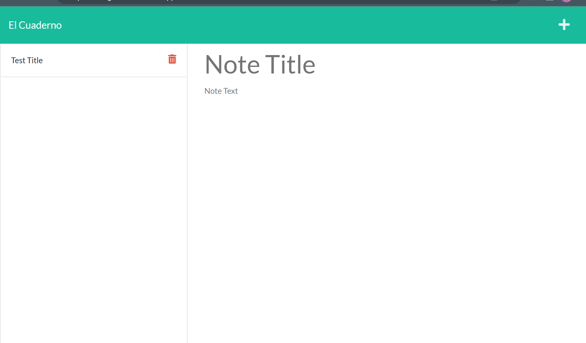

# El Cuaderno
## Description
  
- What was the motivation? To learn how to utilize express to create a server 
- Why did I build this project? To gain experience w/ servers
- What problem does it solve? It creates notes that can persist among different devices
- What did I learn? Express
  
## Table of Contents (Optional)
  
- [Installation](#installation)
- [Usage](#usage)
- [Credits](#credits)
- [License](#license)
- [Questions](#questions)
  
## Installation

Run the website found below
https://quiet-refuge-08138.herokuapp.com/

## Usage
  
Create note by editing title and text then hitting save

Add a screenshot here:
  

  
## Credits
  
Collaborators: None 
  
## License
  
Unlicensed

  
## Questions
  
All questions and communications can be directed to:
Github: github.com/frivera14 

